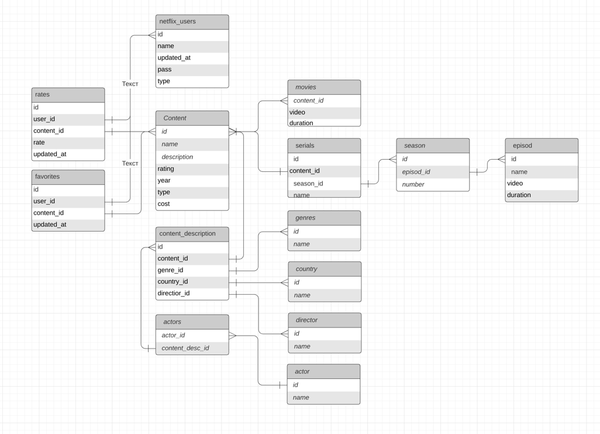

# Netflix
| Целевая аудитория                                 | Россия |
|---------------------------------------------------|--------|
| Размер ЦА                                         | 80млн  |
| Количество посетителей в сутки                    | 800тыс |
| Используемые данные подписчиком в час (в среднем) | 3Гб    |
| Среднее время просмотра | 3.2 часа    |

Источник: https://backlinko.com/netflix-users
## Расчет нагрузки
В сутки Нетфликс посещает 100тыс пользователей => в месяц нетфликс посещает 30 * 8 * 10^5 пользователей.
Главная страница сервиса весит около 0.6 Мб => 4 Тб в месяц нужно отдавать в среднем  
  
Так как нам нужно хранить видео в разных форматах, то для дальнейших расчетов воспользуемся готовым калькулятором (https://toolstud.io/video/filesize.php).
Расчеты будем производить для самых популярных (>1%) разрешений экранов (данные: https://ru.screenresolution.org/year-2020/)
Частота кадров видео - 60 кадров

| Разрешение | Объем (Гб) | 
|------------|------------|
| 1920х1080  | 12.53      |
| 1366х768   | 6.34       |
| 1536х864   | 8.02       |
| 1366х768   | 6.34       |

Получается одно видео в среднем будет занимать ~34Гб. На официальной статистике нетфликса сказано, что контента на 36000 =>
36000 * 34 = 1200Тб

#### средний трафик:
800000 * 3 * 3.2 * 8 / (24 * 60 * 60) = 711 Гбит/с
#### пиковый трафик:
800000 * 3 * 3.2 * 8 / (24 * 60 * 60) = 2844 Гбит/с

| запрос | нагрузка, rps | 
|------------|------------|
| профиль | 2 * 8 * 10^5 / (24 * 60 * 60) = 18 |
| страница контента | 15 * 8 * 10^5 / (24 * 60 * 60) = 140 |
| главная страница | 4 * 8 * 10^5 / (24 * 60 * 60) = 40 |
| favorites | 5 * 8 * 10^5 / (24 * 60 * 60) = 46 |
| воспроизведение контента | 15 * 8 * 10^5 / (24 * 60 * 60) = 138 |

## Логическая схема

Примерный расчет веса таблиц:  
content: 4 + 128 + 512 + 2 + 2 + 32 + 8 = 688 -> 688 * 2500 = 1720000 б = 0.001 Гб  
movies: 4 + 128 + 4 = 136 -> 1436 * 136 = 195296 б = ~0 Гб  
serials: 4 + 4 + 4 + 64 = 76 -> 76 * 500 = 38000 б = ~0 Гб  
genres/country/director/actor: 4 * (4 + 64) = 272 -> 50 * 272 = 13600 б = ~0 Гб  
season: 4 + 4 + 4 = 12 -> 12 * 3000 = 36000 б = ~0 Гб  
episod: 4 + 64 + 128 + 4 = 200  -> 30000 * 200 = 6*10^6 б  
netflix_users: 4 + 32 + 8 + 32 + 1 = 77 -> 77 * 8*10^7 = 6 Гб  
rates: 4 + 4 + 4 + 4 + 8 = 24 -> ~5 Гб  
favorites: 4 + 4 + 4 + 8 = 20 -> ~5 Гб   

Sessions: 4 + 32 = 36 -> 36 * 2*10^7 = 0.72 Гб  

пользовательские данные: ~15 Гб  
контент: ~0.01 Гб
авторизация: 0.72 Гб  

## Физическая схема
### Шардирование и репликация
Так как база данных с контентом не является нагруженной, 
а пользовательские запросы небольшую часть от ежедневного трафика, таблицы нет смысла шардировать. 
Основная нагрузка придется на просмотр видео. Для надежности и разгрузки серверов будем использовать репликацию, 
для каждого оригинального сервера будет создаваться две реплики. Для обеспечения отказоустойчивости, при поломке оригинального сервера можно переключиться на реплику
(чек коннекта и перекидывание с одного сервера на другой будет решаться в бизнес-логике сервера). 
Оригинальный сервер будет принимать запросы на запись, а реплики на чтение.

### CDN-сервера
Располагать их будем как можно ближе к городам-миллионникам (Москва, СПб, Казань и другие) и на Дальнем Востоке
Находится будут у провацдеров или в точках обмена трафиком.
Стриминг видео с CDN-сервера будет происходить с помощью VoD-трансляции, 
контент заранее подготовлен и содержит полную информацию для воспроизведения.
Взаимодействие пользователя с CDN-сервером происходит сессионно - контент отдается 
сегментами в буфер пользователю и нужно обеспечить, чтобы просмотр не прерывался при разрыве сессии или при 
смене одного хоста на другой.  

Будем использовать anycast чтобы клиенты направлялись к ближайшим серверам. Когда клиент будет делать запрос, то его запрос
уйдет на роутером и потом на провайдер, который знает маршрут к нашей автономной системе. 
Дальше с помощью протокола динамической маршрутизации (bgp) он найдет кратчайший маршрут до нашей ас. 
Далее пользователь попадает на ближайший cdn.  

CDN в каждой точке содержит файловые сервера, так как контент занимает большой объем, 
поэтому приходится конфигурировать несколько файловых серверов на одном CDN, 
и сервер маршрутизации с таблицами соответствия файловых серверов и контента (можно обеспечить обычной хеш-таблицей).  

Сервера будем делать на два типа:  
одни буду хранить "горячий" контент - 2-3%, а остальные весь оставшийся контент(в сжатом виде)  

На основе данных с сервиса аналитики будем решить какой контент считаем "горячим". Например, наиболее популярный контент 
будем хранить по штуке на равнозначных нодах,
менее популярный будет "прореживать" (любым алгоритмом распределения будем снижать нагрузку на сервера). 
Так мы сможем "размазать" нагрузку  

## Выбор технологий
